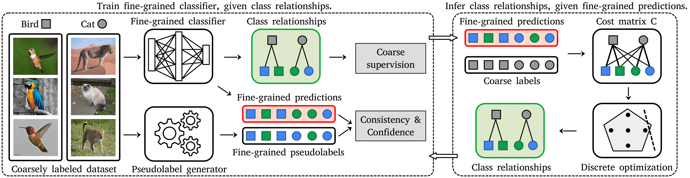

# Fine-grained Classes and How to Find Them

[Matej Grcić](https://matejgrcic.github.io/), [Artyom Gadetsky](http://agadetsky.github.io), [Maria Brbić](https://brbiclab.epfl.ch/team/)

[`Project page`](https://brbiclab.epfl.ch/projects/falcon/)| [`arXiv`](https://arxiv.org/pdf/2406.11070v1) | [`BibTeX`](#citation)

This repo contains PyTorch implementation of the FALCON method. 
FALCON is a method that discovers fine-grained classes in coarsely labeled data without any supervision at the fine-grained level. 
For more details please check our paper [Fine-grained Classes and How to Find Them]() (ICML '24).



## Installation

Setup the conda environment and install the required packages by running the following commands:
```bash
    conda env create -f environment.yml
    conda activate falcon
    ./scripts/setup.sh
```

## Data preparation
We use the standard ImageNet-1k and CIFAR100 datasets. Download the datasets and place them in the desired directory.

For single-cell data, we provide a download and preprocess script:
```bash
    ./scripts/download_sc_data.sh /path/to/datasets_dir
```
Export the dataset paths:
```bash
    export CIFAR100_ROOT=/PATH/TO/CIFAR100
    export IMAGENET_ROOT=/PATH/TO/IMAGENET
    export PBMC_ROOT=/PATH/TO/PREPROCESSED/PBMC
```

## Training

To train FALCON, simply run one of the available scripts. For example, to train FALCON on the Living17 dataset, run:

```bash
    ./script/breeds/living17.sh /path/to/output_dir
```
**Notes:** 
* You might need to make the script executable by running `chmod +x ./script/breeds/living17.sh`
* The training can be resumed by proving the `--resume` flag to `main.py`.

## Evaluation

To evaluate the model, run the following command with the desired config, model path, and output directory:
```bash
    python main.py \
      --cfg_file configs/breeds/coarse2fine/living17.yaml \
      --override_cfg OUTPUT_DIR /path_to_eval_dir \
      --eval_only --model /path_to_model.pth

```
## Checkpoints
Coming soon..


## Citation
If you find our code useful, please consider citing:

```
@inproceedings{
grcic24icml,
title={Fine-grained Classes and How to Find Them},
author={Grci’c, Matej and Gadetsky, Artyom and Brbi’c, Maria},
booktitle={International Conference on Machine Learning},
year={2024},
}
```